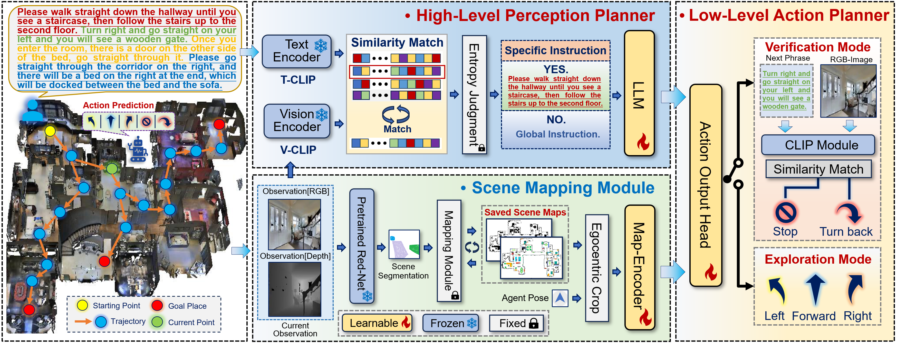

# SeqWalker: Sequential-Horizon Vision-and-Language Navigation with Hierarchical Planning (SH-VLN)

This is the official implementation of  Sequential-Horizon Vision-and-Language Navigation (SH-VLN), a new navigation model for completing a sequential multi-task navigation trajectory through detailed user instructions in persistent large scenes. To ensure persistent and efficient operation, SH-VLN builds and saves explicit scene maps for subsequent episode re-navigation. SH-VLN performs local segmentation for global long instructions using pre-trained CLIP models, to co-analyze the long instructions with the agent's current observations for navigating with users' long instructions task-by-task. Additionally, the segmentation for instructions not only simplifies the processing of complex instructions but also allows trajectory corrections during navigation. We also develop an Exploration and Verification strategy that leverages the logical order of instructions to correct navigation trajectories. To evaluate navigation performance in large scenes, we extend the IVLN dataset and establish a new benchmark. Compared to large language models with the same parameters, our method has superior performance.
<p align="center">
  
</p>

## Setup

1. Dependencies

* Python 3.8
* habitat-sim=0.1.7 headless
* habitat-lab=0.1.7

```bash
conda create --name vln python=3.8
conda activate vln
```

2. Requirements

```bash
pip install -r requirements.txt
```

3. Datasets

The code expects files in this structure (examples of the R2R-CE dataset):

```graphql
data/datasets
├─ RxR_VLNCE_v0
|   ├─ train
|   |    ├─ train_guide.json.gz
|   |    ├─ train_guide_gt.json.gz
|   |    ├─ train_follower.json.gz
|   |    ├─ train_follower_gt.json.gz
|   ├─ val_seen
|   |    ├─ val_seen_guide.json.gz
|   |    ├─ val_seen_guide_gt.json.gz
|   |    ├─ val_seen_follower.json.gz
|   |    ├─ val_seen_follower_gt.json.gz
|   ├─ val_unseen
|   |    ├─ val_unseen_guide.json.gz
|   |    ├─ val_unseen_guide_gt.json.gz
|   |    ├─ val_unseen_follower.json.gz
|   |    ├─ val_unseen_follower_gt.json.gz
|   ├─ test_challenge
|   |    ├─ test_challenge_guide.json.gz
|   ├─ text_features
|   |    ├─ ...
```
The `data/scene_datasets/mp3d` should place all the 3D scene datas of MP3D.

4. Multimodal Large Language Model

Please dowload [clip-b/32] from `huggingface` and place it under the <a href='https://huggingface.co/docs/transformers/model_doc/clip'> `clip-hf` </a>.

Please dowload [LLaVA-one-vision-Qwen2-0.5b], [LLaVA-1.5-0.5b], [LLaVA-1.5-13b] from `huggingface` and place it under the <a href='https://huggingface.co/llava-hf'>`llava-hf` </a>.

Please dowload [LLama3-8b]  from `huggingface` and place it under the <a href='https://huggingface.co/meta-llama/Meta-Llama-3-8B'> `llama-hf`. </a>
## Run Code

### Training Agents
```bash
python run.py \
  --run-type train \
  --exp-config /ivlnce_baselines/config/map_cma/pred_semantics/iterative_maps/0_train_tf.yaml
```

Then, swap `train` for `eval` to evaluate each checkpoint. Take the best performing checkpoint and fine-tune with DAgger:

```bash
python run.py \
  --run-type train \
  --exp-config ivlnce_baselines/config/map_cma/pred_semantics/iterative_maps/1_ftune_dagger.yaml \
  IL.ckpt_to_load /data/checkpoints/map_cma/pred_semantics/iterative_maps/0_tf/ckpt.0.pth
```

### Evaluating Agents
```bash
CUDA_VISIBLE_DEVICES= 0, 1; python run.py \
  --run-type eval \
  --exp-config ivlnce_baselines/config/map_cma/pred_semantics/iterative_maps/2_eval_iterative.yaml
  IL.ckpt_to_load /data/checkpoints/map_cma/pred_semantics/iterative_maps/0_tf/ckpt.0.pth
```

### Acknowledgements

This project is based on the [VLN-CE] and [IVLN-CE], our CLIP is based on [clip-b/32], our LLM is based on [Qwen-0.5b], we load [LLaVA-OneVision-qwen2-7b] and LLaMa is based on Please dowload [LLama-13b].

We are grateful for all these good works!